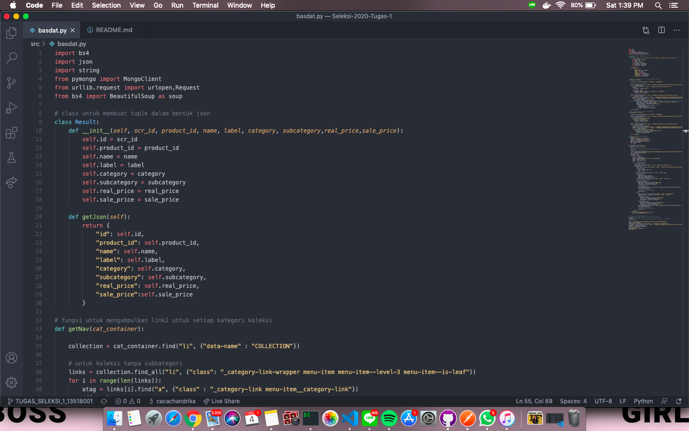
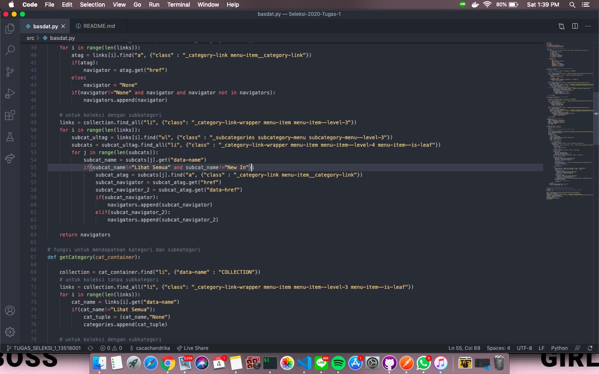

<h1 align="center">
  <br>
  Seleksi Warga Basdat 2020
  <br>
  <br>
</h1>

<h2 align="center">
  <br>
  Tugas 1 : Data Scraping
  <br>
  <br>
</h2>

## Description

[The Movie Database / TMDb](themoviedb.org) adalah sebuah website film dan TV show yang dibuat oleh komunitas. Program ini dibuat dengan melakukan data scraping dari website tersebut, yang berfungsi untuk memudahkan pengguna dalam menemukan TV show berdasarkan urutan _rating_ yang diberikan oleh _user_ yang terdaftar pada website tersebut. Dalam program ini pun pengguna dapat menemukan informasi terkait TV show seperti genre, sinopsis, dll.

## Specification

1. Lakukan _data scraping_ dari sebuah laman web untuk memperoleh data atau informasi tertentu __TANPA MENGGUNAKAN API__. Hasil _data scraping_ ini nantinya akan disimpan dalam DBMS dan digunakan sebagai bahan tugas analisis dan visualisasi data.

2. Daftarkan judul topik yang akan dijadikan bahan _data scraping_ dan DBMS yang akan digunakan pada spreadsheet berikut: [Topik Data Scraping](https://docs.google.com/spreadsheets/d/1TKpyye-ZuoW0npGzylXqvQng3zYm0EzfA9RHjfeFZBk/edit?usp=sharing). Usahakan agar tidak ada peserta dengan topik yang sama. Akses edit ke spreadsheet akan ditutup tanggal __8 Juni 2020 pukul 23.59 WIB__

3. Dalam mengerjakan tugas, calon warga basdat terlebih dahulu melakukan _fork_ project github pada link berikut: https://github.com/wargabasdat/Seleksi-2020-Tugas-1. Sebelum batas waktu pengumpulan berakhir, calon warga basdat harus sudah melakukan _pull request_ dengan nama ```TUGAS_SELEKSI_1_[NIM]```

4. Pada _repository_ tugas 1, calon warga basdat harus mengumpulkan _file script_, json hasil _data scraping_. _Repository_ terdiri dari _folder_ `src`, `data` dan `screenshots`. _Folder_ `src` berisi _file script_/kode yang __*WELL DOCUMENTED* dan *CLEAN CODE*__, _folder_ `data` berisi _file_ json hasil _scraper_ sedangkan _folder_ `screenshot` berisi tangkapan layar program.

5. Deadline pengumpulan tugas 1 adalah <span style="color:red">__15 Juni 2020 Pukul 23.59 WIB__</span>

6. Sebagai referensi untuk mengenal _data scraping_, asisten menyediakan dokumen "_Short Guidance To Data Scraping_" yang dapat diakses pada link berikut: [Data Scraping Guidance](http://bit.ly/DataScrapingGuidance). Mohon memperhatikan etika dalam melakukan _scraping_.

7. Tambahkan juga `.gitignore` pada _file_ atau _folder_ yang tidak perlu di-_upload_, __NB: BINARY TIDAK DIUPLOAD__

8. JSON harus dinormalisasi dan harus di-_preprocessing_
```
Preprocessing contohnya :
- Cleaning
- Parsing
- Transformation
- dan lainnya
```

9. Berikan `README` yang __WELL DOCUMENTED__ dengan cara __override__ _file_ `README.md` ini. `README` harus memuat minimal konten:
```
- Description
- Specification
- How to use
- JSON Structure
- Screenshot program (di-upload pada folder screenshots, di-upload file image nya, dan ditampilkan di dalam README)
- Reference (Library used, etc)
- Author
```

## How to Use

### Prerequisites

* Python 3
* Python Libraries (BeautifulSoup, Requests)
* Virtual Environment

1. _Clone_ atau _download_ repository github ini

2. Buka terminal pada direktori file yang telah di _clone_ atau di _download_. Kemudian ketik perintah berikut `python -m venv virtual-env` pada terminal

3. Setelah terinstall, ketik perintah `virtual-env\Scripts\activate.bat` berikut pada terminal 

4. Install python libraries yang dibutuhkan. Ketik `pip install bs4` dan `pip install requests` pada terminal

5. Ketik perintah berikut `cd src` pada terminal untuk pindah menuju direktori _src_ 

6. Ketik perintah berikut `python ShowScraper.py` pada terminal untuk menjalankan program. Tunggu beberapa saat maka Anda akan melihat data-data yang telah diambil dari _website_ tersimpan pada file JSON di dalam folder _data_

### Things to Note

Program ini dijalankan pada komputer dengan sistem operasi Windows. Anda mungkin diharapkan untuk melakukan penyesuaian terhadap komputer Anda apabila tidak menjalankan Windows

## JSON Structure
```
----title= judul TV show

----synopsis= sinopsis TV show

----genre= genre TV show. Dapat berupa multivalue

----duration= durasi TV show. Dituliskan dalam format menit / jam dan menit. Bernilai null apabila tidak diketahui

----certification= sertifikasi TV show. Bernilai null apabila tidak diketahui

----release_date= tanggal rilis TV show

----rating= rating TV show oleh pengguna yang terdaftar pada themoviedb.org
```

## Screenshot

*Source code*



*JSON Structure*



## Reference

* BeautifulSoup (bs4)
* Requests
* JSON
* Time
* Calendar

## Author

*Indra Febrio Nugroho 13518016*