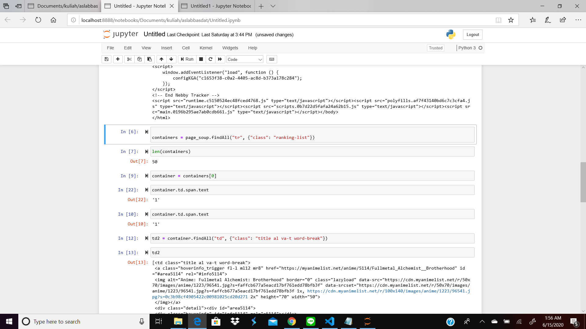

<h1 align="center">
  <br>
  Seleksi Warga Basdat 2020
  <br>
  <br>
</h1>

<h2 align="center">
  <br>
  Tugas 1 : Data Scraping
  <br>
  <br>
  Daftar Lowongan Part Time Web Development di Studentjob.co.id
  <br>
</h2>


### Description

Progam dibuat untuk melakukan scraping data pada website studentjob.co.id untuk mendapatkan semua daftar lowongan pekerjaan parttime untuk Web Development. Hasil data scrap adalah jenis job yang ditawarkan dan deskripsi kebutuhan yang dibutuhkan bagi pelamar pekerjaan.

### Specification

Program ini ditulis menggunakan bahasa pemrogramman Python dan memanfaatkan library yang disediakan Python untuk melakukan Scraping data. Library yang digunakan adalah:
1. BeautifulSoup
    BeautifusSoup4 akan melakukan seleksi berbasis ID dan class sehingga mudah untuk melakukan parsing HTML dan mudah untuk mendapatkan isi pada HTML.
2. request
    Library ini memiliki sejumlah fitur seperti dapat menanangni request dengan method GET, POST, PUT, HEAD, OPTION, dan DELETE. Juga dapat menangani custom header untuk melewatkan nilai - nilai tertentu saat akan melakukan request.
3. json
    Library ini digunakan untk melakukan dump dari array ke file json
4. re
    Library ini digunakan untuk melakukan regex untuk membersihkan hasil data scraping.
### How to Use

1. Buka terminal dan buat path sampi ke folder src
2. Pastikan semua library yang digunakan pada program sudah terinstall
3. Jalankan program dengan perintah python web-scrap.py

### JSON Strucuture
```
{
        "jobTitle": "Job Title yang digunakan oleh pembuka lowongan",
        "jobType": "Jenis kerja yang ditawarkan, misal parttime atau fulltime",
        "jobDesc": "Deskripsi yang dikerjakan atau kebutuhan yang dibutuhkan"
    }
```
Contoh data:
```
{
        "jobTitle": "Business Development Partime",
        "jobType": "Part Time",
        "jobDesc": "Business Development (BD) - Part-time job is a position to leverage your resources and skills to recruit UC wemedia members among develop journalists/bloggers/writers communities or individuals."
    }
```
### Screenshot

<p align = "center">

</p>
<p align = "center">

</p>
### Reference

```
https://requests.readthedocs.io/en/master/
https://pypi.org/project/beautifulsoup4/
https://docs.python.org/3/library/json.html
```

### Author
Fatkhan Masruri
13518053

