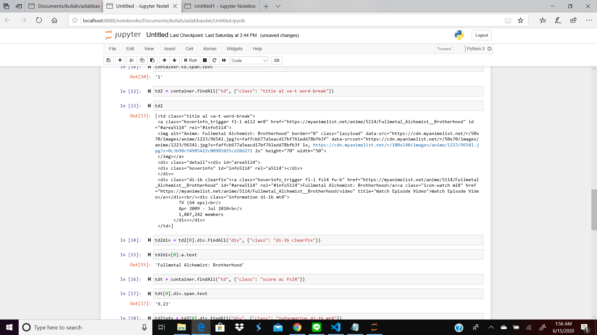

<h1 align="center">
  <br>
  Seleksi Warga Basdat 2020
  <br>
  <br>
</h1>

<h2 align="center">
  <br>
  Tugas 1 : Data Scraping
  <br>
  <br>
  Daftar Lowongan Part Time Web Development di Studentjob.co.id
  <br>
</h2>


### Description

Progam dibuat untuk melakukan scraping data pada website studentjob.co.id untuk mendapatkan semua daftar lowongan pekerjaan parttime untuk Web Development. Hasil data scrap adalah jenis job yang ditawarkan dan deskripsi kebutuhan yang dibutuhkan bagi pelamar pekerjaan.

### Specification

### Data Scraping

1. Lakukan _data scraping_ dari sebuah laman web untuk memperoleh data atau informasi tertentu __TANPA MENGGUNAKAN API__. Hasil _data scraping_ ini nantinya akan disimpan dalam DBMS dan digunakan sebagai bahan tugas analisis dan visualisasi data.

2. Daftarkan judul topik yang akan dijadikan bahan _data scraping_ dan DBMS yang akan digunakan pada spreadsheet berikut: [Topik Data Scraping](https://docs.google.com/spreadsheets/d/1TKpyye-ZuoW0npGzylXqvQng3zYm0EzfA9RHjfeFZBk/edit?usp=sharing). Usahakan agar tidak ada peserta dengan topik yang sama. Akses edit ke spreadsheet akan ditutup tanggal __8 Juni 2020 pukul 23.59 WIB__

3. Dalam mengerjakan tugas, calon warga basdat terlebih dahulu melakukan _fork_ project github pada link berikut: https://github.com/wargabasdat/Seleksi-2020-Tugas-1. Sebelum batas waktu pengumpulan berakhir, calon warga basdat harus sudah melakukan _pull request_ dengan nama ```TUGAS_SELEKSI_1_[NIM]```

4. Pada _repository_ tugas 1, calon warga basdat harus mengumpulkan _file script_, json hasil _data scraping_. _Repository_ terdiri dari _folder_ `src`, `data` dan `screenshots`. _Folder_ `src` berisi _file script_/kode yang __*WELL DOCUMENTED* dan *CLEAN CODE*__, _folder_ `data` berisi _file_ json hasil _scraper_ sedangkan _folder_ `screenshot` berisi tangkapan layar program.

5. Deadline pengumpulan tugas 1 adalah <span style="color:red">__15 Juni 2020 Pukul 23.59 WIB__</span>

6. Sebagai referensi untuk mengenal _data scraping_, asisten menyediakan dokumen "_Short Guidance To Data Scraping_" yang dapat diakses pada link berikut: [Data Scraping Guidance](http://bit.ly/DataScrapingGuidance). Mohon memperhatikan etika dalam melakukan _scraping_.

7. Tambahkan juga `.gitignore` pada _file_ atau _folder_ yang tidak perlu di-_upload_, __NB: BINARY TIDAK DIUPLOAD__

8. JSON harus dinormalisasi dan harus di-_preprocessing_
```
Preprocessing contohnya :
- Cleaning
- Parsing
- Transformation
- dan lainnya
```

9. Berikan `README` yang __WELL DOCUMENTED__ dengan cara __override__ _file_ `README.md` ini. `README` harus memuat minimal konten:
```
- Description
- Specification
- How to use
- JSON Structure
- Screenshot program (di-upload pada folder screenshots, di-upload file image nya, dan ditampilkan di dalam README)
- Reference (Library used, etc)
- Author
```

### How to Use

1. Buka terminal dan buat path sampi ke folder src
2. Pastikan semua library yang digunakan pada program sudah terinstall
3. Jalankan program dengan perintah python web-scrap.py

### JSON Strucuture
```
{
        "jobTitle": "Job Title yang digunakan oleh pembuka lowongan",
        "jobType": "Jenis kerja yang ditawarkan, misal parttime atau fulltime",
        "jobDesc": "Deskripsi yang dikerjakan atau kebutuhan yang dibutuhkan"
    }
```
Contoh data:
```
{
        "jobTitle": "Business Development Partime",
        "jobType": "Part Time",
        "jobDesc": "Business Development (BD) - Part-time job is a position to leverage your resources and skills to recruit UC wemedia members among develop journalists/bloggers/writers communities or individuals."
    }
```
### Screenshot

<p align = "center">

</p>
<p align = "center">

</p>

### Reference

Program ini ditulis menggunakan bahasa pemrogramman Python dan memanfaatkan library yang disediakan Python untuk melakukan Scraping data. Library yang digunakan adalah:
1. BeautifulSoup
    BeautifusSoup4 akan melakukan seleksi berbasis ID dan class sehingga mudah untuk melakukan parsing HTML dan mudah untuk mendapatkan isi pada HTML.
2. request
    Library ini memiliki sejumlah fitur seperti dapat menanangni request dengan method GET, POST, PUT, HEAD, OPTION, dan DELETE. Juga dapat menangani custom header untuk melewatkan nilai - nilai tertentu saat akan melakukan request.
3. json
    Library ini digunakan untk melakukan dump dari array ke file json
4. re
    Library ini digunakan untuk melakukan regex untuk membersihkan hasil data scraping.

### Author
Fatkhan Masruri
13518053

